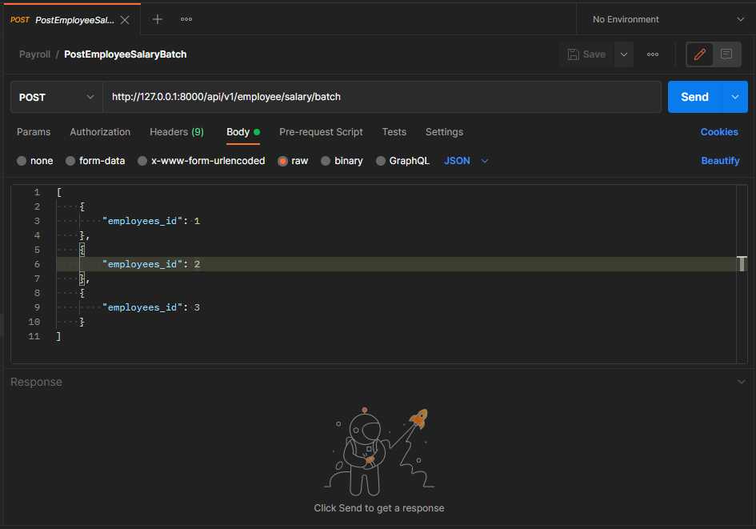

# 👨‍💻 Aplikasi Sistem penggajian

This Application in build using Laravel and full feature REST-API

## 📍 Get Started

+ Configuration
    + Open your terminal and typing ``git clone https://github.com/destroylord/sistem-penggajian-simpel.git``.
    + Please copy and paste file ``.env.example`` to ``.env``
    + Then you typing ``php artisan key:generate`` in terminal
    + Create a database with name same file in ``.env``
    + Then you migrate and Seeder this project ``php artisan migrate --seed``

+ Running QUEUE
    + You can insert using POSTMAN.
    + Example 
        
        
## 📎 Conclusion

This application is simple with fire making that has been provided by the kledo team with a comfortable heart.
